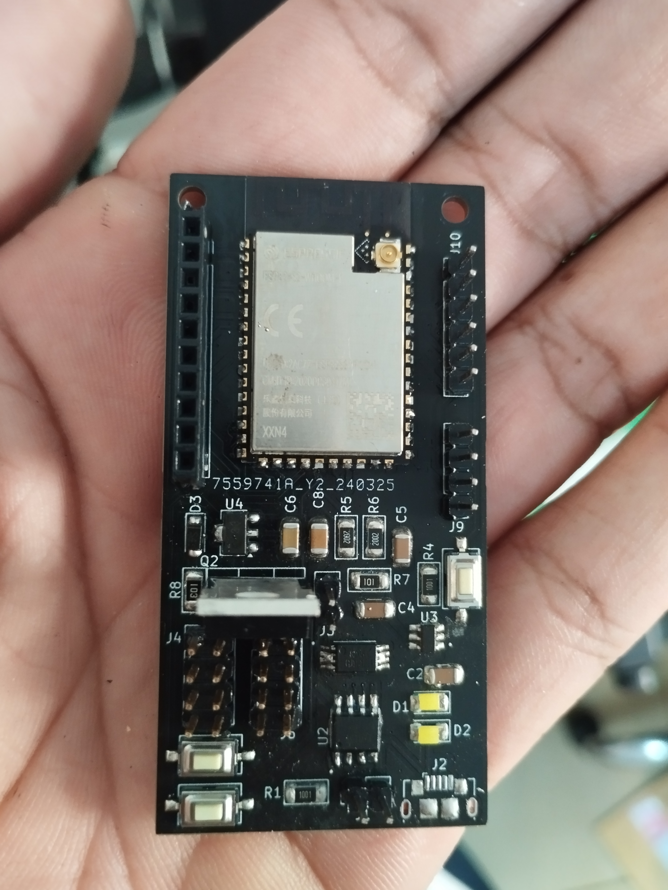

# Placa para Estação Metereológica Colubris (Colubris LoRa Meteorological Station Board)

{width="300"}

A Colubris é uma placa de hardware aberto baseada no microcontrolador ESP32-S2 e equipada com um módulo LoRa SX1262 integrado. Além disso, ela possui um sistema de gerenciamento de bateria que permite carregar e utilizar baterias diretamente pela placa. A principal finalidade da Colubris é equipar estações meteorológicas que operarão em áreas remotas, mas ela é versátil o suficiente para ser usada em outros dispositivos que necessitem de comunicação de longo alcance.

## Vantagens da Colubris

- **Hardware Aberto**: Todo o hardware e software da Colubris é disponibilizado de forma aberta, com esquemas e arquivos de fabricação disponíveis no [GitLab](https://gitlab.com/embarcacoes/estacao-metereologica-lorawan/) do projeto. A única exceção são os chips de origem proprietária usados no projeto.
- **Baixo Consumo de Energia**: A Colubris foi projetada para ter um consumo extremamente baixo, permitindo seu funcionamento com baterias e, assim, tornando-a totalmente independente da rede elétrica. Apenas algumas células solares e uma bateria de 2200 mAh são suficientes para sua operação.
- **Design Simplificado**: Com um design simplificado, a Colubris é fácil de construir sem ferramentas complexas e oferece facilidade de manutenção e modificação.
- **Tamanho Compacto**: A placa possui dimensões de apenas 70 x 35 mm, permitindo sua instalação em espaços limitados.
- **Custo Acessível**: O custo de fabricação da placa é relativamente baixo, possibilitando a produção em larga escala com poucos recursos.

## Como contribuir?

Você pode contribuir de várias maneiras:

- **Reportando bugs**: Identifique problemas de hardware e software e registre-os na seção de [_Issues_](https://gitlab.com/embarcacoes/estacao-metereologica-lorawan/-/issues) do GitLab do projeto.

- **Aprimorando o design**: Colabore com versões futuras do design da placa, acessando e modificando os arquivos do projeto KiCad disponíveis no GitLab.

- **Fornecendo exemplos e aplicações**: Compartilhe exemplos de software e aplicações para a placa, incluindo aprimoramentos para o firmware principal.

Sua participação é valiosa para o desenvolvimento contínuo do projeto.

## Entre para a Comunidade:

- [Grupo no Telegram](https://t.me/+PdSj1sTUFSIyOGVh)

Esse site e licenciado sobre licença [CC-BY-SA-4.0](https://gitlab.com/embarcacoes/estacao-metereologica-lorawan/-/blob/main/docs/LICENSE.md?ref_type=heads)
